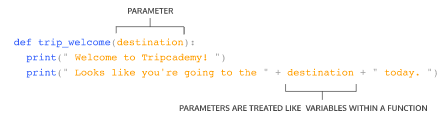
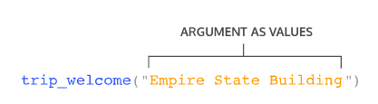

# Whitespace & Execution Flow
Consider our welcome function for our trip planning application:
```python
def trip_welcome():
  print("Welcome to Tripcademy!") 
  print("Let's get you to your destination.")
```
The print statements all run together when ```trip_welcome()``` is called. This is because they have the same base level of indentation (2 spaces).

In Python, the amount of whitespace tells the computer what is part of a function and what is not part of that function.

If we wanted to write another statement outside of ```trip_welcome()```, we would have to unindent the new line:
```python
def trip_welcome():
  # Indented code is part of the function body
  print("Welcome to Tripcademy!") 
  print("Let's get you to your destination.")
 
# Unindented code below is not part of the function body
print("Woah, look at the weather outside! Don't walk, take the train!")
 
trip_welcome()
```
Our ```trip_welcome()``` function steps will not print Woah, look at the weather outside! Don't walk, take the train! on our function call. The ```print() ```statement was unindented to show it was not a part of the function body but rather a separate statement.

We would see the following output from this program:
```
Woah, look at the weather outside! Don't walk, take the train!
Welcome to Tripcademy!
Let's get you to your destination.
```

Lastly, note that the execution of a program always begins on the first line. The code is then executed one line at a time from top to bottom. This is known as execution flow and is the order a program in python executes code.

Woah, look at the weather outside! Don't walk, take the train! was printed before the ```print() ```statements from the function ```trip_welcome()```.

Even though our function was defined before our lone``` print() ```statement, we didn’t call our function until after.

Let’s play around with indentation and the flow of execution!

# Instructions
1.
We are going to help our trip planner users figure out if they should travel today based on the weather. Let’s let our users know we can check the weather for them.

Write a``` print()``` statement that will output Checking the weather for you!.


2.
We took a look outside and see a bright sunny day. Write a function called ```weather_check() ```that will print a message to our users that it’s a great day to travel! The function should output:

Looks great outside! Enjoy your trip.
Note: Don’t call your function just yet! We will do that in the next step.


3.
Oh no! It looks like some clouds came in and it started raining. Our users shouldn’t go on a trip in the rain. In our weather_check() function add a second ```print() ```statement under the first one which prints a warning message for our travelers! It should print:
```
False Alarm, the weather changed! There is a thunderstorm approaching. Cancel your plans and stay inside.
```

4.
Call the function ```weather_check()```.

5.
Unindent your final print statement in your ```weather_check()``` function. Run the program again.

What is different?

# Parameters & Arguments
Let’s return to our trip_welcome() function one more time! Let’s modify our function to give a welcome that is a bit more detailed.
```python
def trip_welcome():
  print("Welcome to Tripcademy!") 
  print("Looks like you're going to Times Square today.")
 
trip_welcome()
```
This will output:
```
Welcome to Tripcademy!
Looks like you're going to Times Square today.
```
Our function does a really good job of welcoming anyone who is traveling to Times Square but a really poor job if they are going anywhere else. In order for us to make our function a bit more dynamic, we are going to use the concept of function parameters.

Function parameters allow our function to accept data as an input value. We list the parameters a function takes as input between the parentheses of a function ```( )```.

Here is a function that defines a single parameter:
```python
def my_function(single_parameter)
  # some code
```
In the context of our trip_welcome() function, it would look like this:
```python
def trip_welcome(destination):
  print("Welcome to Tripcademy!") 
  print("Looks like you're going to " + destination + " today.")
```
In the above example, we define a single parameter called destination and apply it in our function body in the second print statement. We are telling our function it should expect some data passed in for destination that it can apply to any statements in the function body.

But how do we actually use this parameter? Our parameter of destination is used by passing in an argument to the function when we call it.
```
trip_welcome("Times Square")
```
This would output:
```
Welcome to Tripcademy!
Looks like you're going to Times Square today. 
```
To summarize, here is a quick breakdown of the distinction between a parameter and an argument:

The parameter is the name defined in the parenthesis of the function and can be used in the function body.



The argument is the data that is passed in when we call the function and assigned to the parameter name.



# Instructions
1.
We want to create a program that allows our users to generate the directions for their upcoming trip!

Create a function called ```generate_trip_instructions()``` that defines one parameter called location.

Note: Since we did not define any code in our function yet, we will receive an error in our output terminal. Don’t worry, we will be filling in the code in the next step.


2.
```generate_trip_instructions()``` should print out the following:
```
Looks like you are planning a trip to visit <location>
Where <location> will represent the location parameter.
```

3.
```generate_trip_instructions() ```should also let our users know they can reach their location using public transit.

Let’s have ```generate_trip_instructions()``` also print out the following on a new line:
```
You can use the public subway system to get to <location>
Where <location> will represent the location parameter.
```

4.
Time for some greenery! Let’s see what happens when we call the function and input the argument ```"Central Park"```, a backyard wonder in the heart of New York City.


5.
The day trip is over and we need to get back to the train station to head home. Change the argument to ```"Grand Central Station" ```and call the function again.

What changed in the output?


# Multiple Parameters
Using a single parameter is useful but functions let us use as many parameters as we want! That way, we can pass in more than one input to our functions.

We can write a function that takes in more than one parameter by using commas:
```python
def my_function(parameter1, parameter2, parameter3):
  # Some code
```
When we call our function, we will need to provide arguments for each of the parameters we assigned in our function definition.
```python
# Calling my_function
my_function(argument1, argument2)
```
For example take our trip application’s trip_welcome() function that has two parameters:
```python
def trip_welcome(origin, destination):
  print("Welcome to Tripcademy")
  print("Looks like you are traveling from " + origin)
  print("And you are heading to " + destination)
```
Our two parameters in this function are origin and destination. In order to properly call our function, we need to pass argument values for both of them.

The ordering of your parameters is important as their position will map to the position of the arguments and will determine their assigned value in the function body (more on this in the next exercise!).

Our function call could look like:
```python
trip_welcome("Prospect Park", "Atlantic Terminal")
```
In this call, the argument value of ```"Prospect Park"``` is assigned to be the origin parameter, and the argument value of ```"Atlantic Terminal" ```is assigned to the destination parameter.

The output would be:
```
Welcome to Tripcademy
Looks like you are traveling from Prospect Park
And you are heading to Atlantic Terminal
```
Let’s practice writing and calling a multiple parameter function!

# Instructions
1.
Our travel application users want to calculate the total expenses they may have to incur on a trip.

Write a function called``` calculate_expenses``` that will have four parameters (in exact order):
```
plane_ticket_price
car_rental_rate
hotel_rate
trip_time
```
Each of these parameters will account for a different expense that our users will incur.

Note: Like before, if we run this function now, we will get an error since there are no statements in the body.


2.
Within the body of the function, let’s start to make some calculations for our expenses. First, let’s calculate the total price for a car rental.

Create new variable called ```car_rental_total``` that is the product of ```car_rental_rate ```and ```trip_time```.


3.
Next, we want to apply the same logic but for our hotel_rate.

Create new variable called ```hotel_total``` that is the product of ```hotel_rate ```and ```trip_time```.

We also have a coupon to give our users some cashback for their hotel visit so subtract 10 from that total in the same statement. Woohoo, coupons! 💵


4.
Lastly, let’s print a nice message for our users to see the total. Use print to output the sum of ```car_rental_total```,``` hotel_total``` and ```plane_ticket_price```.


5.
Call your function with the following argument values for the parameters listed:
```
plane_ticket_price : 200
car_rental_rate : 100
hotel_rate : 100
trip_time: 5
```

# Types of Arguments
In Python, there are 3 different types of arguments we can give a function.

* Positional arguments: arguments that can be called by their position in the function definition.

* Keyword arguments: arguments that can be called by their name.

* Default arguments: arguments that are given default values.

Positional Arguments are arguments we have already been using! Their assignments depend on their positions in the function call. Let’s look at a function called calculate_taxi_price() that allows our users to see how much a taxi would cost to their destination 🚕.
```python
def calculate_taxi_price(miles_to_travel, rate, discount):
  print(miles_to_travel * rate - discount )
```
In this function, miles_to_travel is positioned as the first parameter, rate is positioned as the second parameter, and discount is the third. When we call our function, the position of the arguments will be mapped to the positions defined in the function declaration.
```python
# 100 is miles_to_travel
# 10 is rate
# 5 is discount
calculate_taxi_price(100, 10, 5)
```
Alternatively, we can use Keyword Arguments where we explicitly refer to what each argument is assigned to in the function call. Notice in the code example below that the arguments do not follow the same order as defined in the function declaration.
```
calculate_taxi_price(rate=0.5, discount=10, miles_to_travel=100)
```

Lastly, sometimes we want to give our function arguments default values. We can provide a default value to an argument by using the assignment operator (=). This will happen in the function declaration rather than the function call.

Here is an example where the discount argument in our ```calculate_taxi_price``` function will always have a default value of 10:
```python
def calculate_taxi_price(miles_to_travel, rate, discount = 10):
  print(miles_to_travel * rate - discount )
```
When using a default argument, we can either choose to call the function without providing a value for a discount (and thus our function will use the default value assigned) or overwrite the default argument by providing our own:
```python
# Using the default value of 10 for discount.
calculate_taxi_price(10, 0.5)
 
# Overwriting the default value of 10 with 20
calculate_taxi_price(10, 0.5, 20)
```

# Instructions
1.
Tripcademy (our trusty travel app) needs to allow passengers to plan a trip.

Write a function called ```trip_planner() ```that will have three parameters: ```first_destination```,``` second_destination``` and ```final_destination```.

Give the ```final_destination ```parameter a default value of "Codecademy HQ".

Note: Since we did not define any code in our function yet, we will receive an error in our output terminal. Don’t worry, we will be filling in the code in the next step.


2.
First, we want to introduce the trip to users. Use ```print()``` in our function to output Here is what your trip will look like!.


3.
In our function definition let’s provide an itinerary that will describe the destinations our user will visit in order. Print a statement that follows this form:
```
First, we will stop in <first_destination>, then <second_destination>, and lastly <final_destination>
```
An example call to our function using positional arguments:
```
trip_planner("London", "India", "New Zealand")
```
Should output:
```
Here is what your trip will look like!
First, we will stop in London, then India, and lastly New Zealand
```
To test out your function, call ```trip_planner()``` with the following values for the parameters:
```
first_destination: "France"

second_destination: "Germany"

final_destination: "Denmark"
```


4.
Call the function ```trip_planner()``` again with the following values for the parameters:
```
first_destination: "Denmark"

second_destination: "France"

final_destination: "Germany"
```
Note the difference in your output depending on the position of your arguments.

5.
Call the function ```trip_planner()``` again using keyword arguments in this exact order:
```
first_destination: "Iceland"

final_destination: "Germany"

second_destination: "India"
```

6.
Lastly, go ahead and call the function``` trip_planner() ```using only two positional arguments to see the default argument in action:
```
first_destination: "Brooklyn"

second_destination: "Queens"
```

# Built-in Functions vs User Defined Functions
There are two distinct categories for functions in the world of Python. What we have been writing so far in our exercises are called User Defined Functions - functions that are written by users (like us!).

There is another category called Built-in functions - functions that come built into Python for us to use. Remember when we were using print or str? Both of these functions are built into the language for us, which means we have been using built-in functions all along!

There are lots of different built-in functions that we can use in our programs. Take a look at this example of using len() to get the length of a string:
```python
destination_name = "Venkatanarasimharajuvaripeta"
 
# Built-in function: len()
length_of_destination = len(destination_name)
 
# Built-in function: print()
print(length_of_destination)
```
Would output the value of length_of_destination:
```
28
```
Here we are using a total of two built-in functions in our example: ```print()```, and ```len()```.

And yes, if you’re wondering, that is a real railway station in India!

There are even more obscure ones like``` help()``` where Python will print a link to documentation for us and provide some details:
```python
help("string")
```
Would output (shortened for readability):
```
NAME
    string - A collection of string constants.
 
MODULE REFERENCE
    https://docs.python.org/3.8/library/string
 
    The following documentation is automatically generated from the Python
    source files.  It may be incomplete, incorrect or include features that
    are considered implementation detail and may vary between Python
    implementations.  When in doubt, consult the module reference at the
    location listed above.
.....
```

Let’s practice using a few built in functions. You will need to rely on the provided Python documentation links to find your answers!

[official Python docs](https://docs.python.org/3/library/functions.html)


# Instructions
1.
We were provided a list of prices for some gift shop items:
```
T-shirt: 9.75
Shorts: 15.50
Mug: 5.99
Poster: 2.00
```
Create a variable called ```max_price``` and call the built-in function ```max()``` with the variables of prices to get the maximum price.

Print``` max_price```.


2.
Using the same set of prices, create a new variable called``` min_price ```and use the built-in function``` min()``` with the variables of prices to get the minimum price.

Print ```min_price```.


3.
Use the built-in function ```round()``` to round the price of the variable ```tshirt_price ```by one decimal place.

Save the result to a variable called ```rounded_price``` and print it.


# Variable Access
As we expand our programs with more functions, we might start to ponder, where exactly do we have access to our variables? To examine this, let’s revisit a modified version of the first function we built out together:
```python
def trip_welcome(destination):
  print(" Looks like you're going to the " + destination + " today. ")
```

What if we wanted to access the variable destination outside of the function? Could we use it? Take a second to think about what the following program will output, then check the result below!
```python
def trip_welcome(destination):
  print(" Looks like you're going to the " + destination + " today. ")
 
print(destination)
```
```
NameError: name 'destination' is not defined
```
If we try to run this code, we will get a``` NameError```, telling us that destination is not defined. The variable ```destination``` has only been defined inside the space of a function, so it does not exist outside the function.


We call the part of a program where destination can be accessed its scope. The scope of destination is only inside the``` trip_welcome()```.

Take a look at another example:
```python
budget = 1000
 
# Here we are using a default value for our parameter of `destination` 
def trip_welcome(destination="California"):
    print(" Looks like you're going to " + destination)
    print(" Your budget for this trip is " + str(budget))
 
print(budget)
trip_welcome()
```
Our output would be:
```
1000

Looks like you're going to California 
Your budget for this trip is 1000
```
Here we are able to access the budget both inside the``` trip_welcome ```function as well as our ```print()``` statement. If a variable lives outside of any function it can be accessed anywhere in the file.

We will be exploring the concept of scope more after this entire lesson but for now, let’s play around!


# Instructions
1.
Our users want to be able to save a list of their favorite places in our travel application.

We have received a rough draft for this implementation from another coder, but there are some problems with variable scope which prevent it from working properly.

Take a second to understand what the program is doing and then hit Run the code to see the error.


2.
Looking at the error, it seems like the main issue is that ```favorite_locations``` is not defined. Why would our program not be able to see our beautiful ```favorite_locations``` variable?

Aha! It must be a scope issue. Fix the scope of ```favorite_locations``` so that both our functions can access it.
```
Traceback (most recent call last):
  File "travel.py", line 11, in <module>
    show_favorite_locations()
  File "travel.py", line 8, in show_favorite_locations
    print("Your favorite locations are: " + favorite_locations)
NameError: name 'favorite_locations' is not defined
```

# Returns
At this point, our functions have been using print() to help us visualize the output in our interpreter. Functions can also return a value to the program so that this value can be modified or used later. We use the Python keyword return to do this.

Here’s an example of a program that will return a converted currency for a given location a user may want to visit in our trip planner application.
```python
def calculate_exchange_usd(us_dollars, exchange_rate):
  return us_dollars * exchange_rate
 
new_zealand_exchange = calculate_exchange_usd(100, 1.4)
 
print("100 dollars in US currency would give you " + str(new_zealand_exchange) + " New Zealand dollars")
```
This would output:
```
100 dollars in US currency would give you 140 New Zealand dollars
```

Saving our values returned from a function like we did with ```new_zealand_exchange``` allows us to reuse the value (in the form of a variable) throughout the rest of the program.

When there is a result from a function that is stored in a variable, it is called a returned function value.

Let’s try to return some data in the exercises!

Note: Working with multiple functions can be a bit overwhelming at first. Don’t hesitate to use hints or even look at the solution code if you get stuck.

# Instructions
1.
Our travel application is getting really popular. Some of our users have posted on social media that it would be useful if our application could help them track their budget during trips. We want to help them track their starting budget and let them know how much they have left after an expense.

We have provided some starting code to get started. Take a second to understand the code and then click Run and take a look at the output.


2.
Let’s create a new function called ```deduct_expense()``` that will take two parameters.

The first parameter will be ```budget``` and the second parameter will be ```expense```. Our function will be taking in a budget value as well as the expense we want to subtract.

We will want our function to return the budget minus the expense our travelers are incurring.

3.
Looks like the most common expense our travelers are incurring is a t-shirt purchase.

Let’s create a variable called``` shirt_expense``` and for now, we will give it a set value of 9 (We are not accounting for currency changes at the moment). Make sure this is defined outside of the functions in your script.


4.
Now that we have an expense to subtract, create a new variable called ```new_budget_after_shirt ```and set it to be the function call of ```deduct_expense()```.

Pass our ```current_budget``` variable as the first argument and the ```shirt_expense ```variable as the second argument.

5.
Lastly, we want our users to see the remaining budget.

Call the provided ```print_remaining_budget()``` function, passing in ```new_budget_after_shirt ```as the only argument.


6.
Great Job! This is the biggest program with functions we have built so far! Take a second to review your code and click Run one last time when you are ready to move on.

# Multiple Returns
Sometimes we may want to return more than one value from a function. We can return several values by separating them with a comma. Take a look at this example of a function that allows users in our travel application to check the upcoming week’s weather (starting on Monday):
```python
weather_data = ['Sunny', 'Sunny', 'Cloudy', 'Raining', 'Snowing']
 
def threeday_weather_report(weather):
  first_day = " Tomorrow the weather will be " + weather[0]
  second_day = " The following day it will be " + weather[1]
  third_day = " Two days from now it will be " + weather[2]
  return first_day, second_day, third_day
```

This function takes in a set of data in the form of a list for the upcoming week’s weather. We can get our returned function values by assigning them to variables when we call the function:
```
monday, tuesday, wednesday = threeday_weather_report(weather_data)
 
print(monday)
print(tuesday)
print(wednesday)
```
This will print:
```
Tomorrow the weather will be Sunny
The following day it will be Sunny
Two days from now it will be Cloudy
```
Let’s practice using multiple returns by returning to our previous code example.

# Instructions
1.
Our users liked the previous functionality that we added to our travel application, but recently we have had an influx of users planning trips in Italy. We want to create a small function to output the top places to visit in Italy. Another member of our team already started on the implementation of this feature but it is still missing a few key details.

Take a second to review the code and click Run when you are ready to move on. For now, there will be no output.

2.
We want to be able to return the three most popular destinations from our function ```top_tourist_locations_italy()```.

Add a line in the function ```top_tourist_locations_italy()``` that will return the values of ```first```,``` second```, ```third``` in that exact order.


3.
In order to use our three returned values from ```top_tourist_locations_italy()``` we need to assign them to new variables names after we call our function.

Set the return of the function``` top_tourist_locations_italy()``` to be equal to three new variables called``` most_popular1```, ```most_popular2```, and ```most_popular3 ```in that exact order.

4.
Use three ```print()``` statements to output the value of ```most_popular1```, ```most_popular2```, and ```most_popular3```.